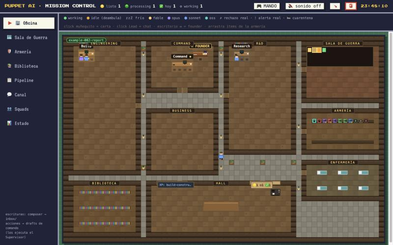
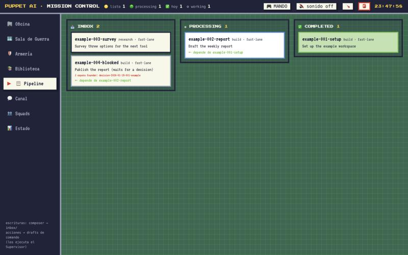
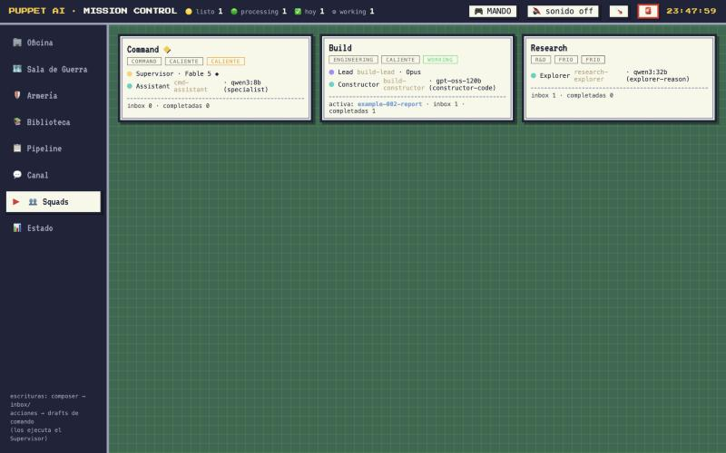
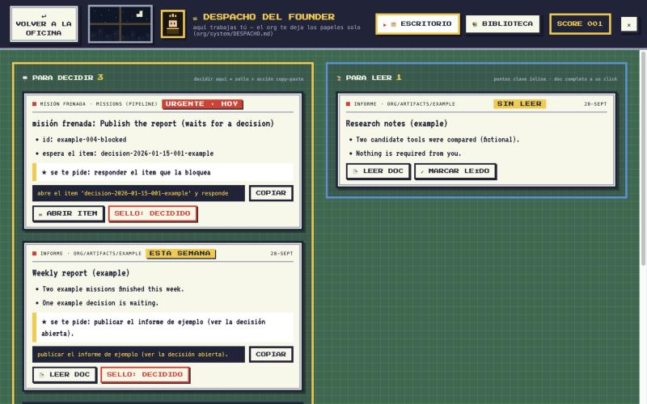

# Mission Control — a local dashboard for a multi-agent operations folder

A local web dashboard that mirrors the state of a folder-based, multi-agent operations setup (squads,
missions, agents, reports, events) and includes a **Despacho** ("desk") panel where one operator handles
decisions and reports.

> **Extracted from an internal multi-agent operations dashboard.**

> **The interface is in Spanish.** The documentation is in English. The header and window title still
> carry the original project's name ("Puppet AI"). All data in this repository is fictional sample data.

## What this repository contains

- **`org/dashboard/`** — the dashboard: a FastAPI server (`app.py`) plus a static front-end (a navigable
  pixel office, war room, armory, library, pipeline kanban, channel, squads and status views), and its tests.
- **The Despacho panel** — the operator's desk inside the dashboard (decisions to make, reports to read,
  what was decided). Its contract is described in [`org/system/DESPACHO.md`](org/system/DESPACHO.md).
- **3 example squads** (`Command`, `Build`, `Research`) in `org/dashboard/squads.json`, with 4 example
  agents in `.claude/agents/`.
- **Fictional sample data** so the dashboard shows something: 4 missions, 2 founder items, 2 artifacts,
  a few events and usage lines.
- **`org/telegram_bridge.py`** — an optional bridge that sends `reports/outbox/` files to a Telegram chat
  and turns a `mision: <order>` message into a mission draft. It is **disabled** unless you set
  `TELEGRAM_BOT_TOKEN` and `TELEGRAM_CHAT_ID`; without them it prints a notice and exits 0.

It does **not** contain an agent runner, orchestrator or scheduler. The dashboard only reads files and
writes drafts, alerts and marks (see below); something of your own has to act on them.

## Screenshots

Sample data only:

| Office | Pipeline |
|---|---|
|  |  |
| **Squads** | **Despacho** |
|  |  |

## Run it

```bash
pip install -r requirements.txt
python3 org/dashboard/app.py          # → http://localhost:8787
```

It listens only on `127.0.0.1` and needs no environment variables. Optional variables are documented in
`.env.example` (`DASHBOARD_PORT`, `DASHBOARD_USER_ID`, `DASHBOARD_OPERATOR_NAME`,
`DASHBOARD_ALLOWED_HOSTS`, and the Telegram ones). To open the Despacho, click the ✉ desk in the COMMAND
room of the Office view.

## Use it with your own data

The dashboard reads plain files, so replacing the samples is just editing them:

| To change | Edit |
|---|---|
| The squads and their seats | `org/dashboard/squads.json` (each squad's `division` must be `Command`, `Engineering`, `R&D` or `Business`: those are the rooms of the office map) |
| Agents | `.claude/agents/*.md` (front-matter: `name`, `model_gateway`, `model_native`, `tools`, `skills`) |
| Missions | `missions/{inbox,processing,completed}/*.md` |
| Decisions and briefs for the operator | `org/founder/{decisiones,preguntas,briefs}/*.md` |
| Reports with a "PUNTOS CLAVE" block | `org/artifacts/**`, `org/system/`, `reports/` (see `org/system/DESPACHO.md`) |

## What the dashboard writes

It never edits or deletes existing files. It only creates new mission and command drafts
(`missions/inbox/`), the pause file `org/PAUSED` plus an alert and an event when the fire-alarm button is
used (it needs the alarm token in `org/dashboard/.alarm-token`, created at first start and git-ignored),
entries in `reports/security.log` for rejected requests, and append-only read/decided marks for the
Despacho. Details in [`org/dashboard/README.md`](org/dashboard/README.md).

## Security model

- Listens on `127.0.0.1` only and **rejects any request whose `Host` header is not loopback** (protects
  the GET endpoints from DNS-rebinding). Extra hosts: `DASHBOARD_ALLOWED_HOSTS`.
- Every POST requires `Content-Type: application/json` and an absent or loopback `Origin`; the command, fire-alarm and Despacho-mark endpoints are rate-limited.
- Document reading is limited to `.md` files under an allow-list of folders.
- The Telegram bridge has no default token, chat id or name, and only the allow-listed user id can create
  missions from a message.
- The dashboard is a single-user, local tool: it has no login. Do not expose it beyond `127.0.0.1`.

## Tests

```bash
python3 -m pytest org/dashboard/tests
```

The tests build a temporary tree with fixture files; they never touch a live folder.

## License

[MIT](LICENSE)

## Author

Josué Arcos
